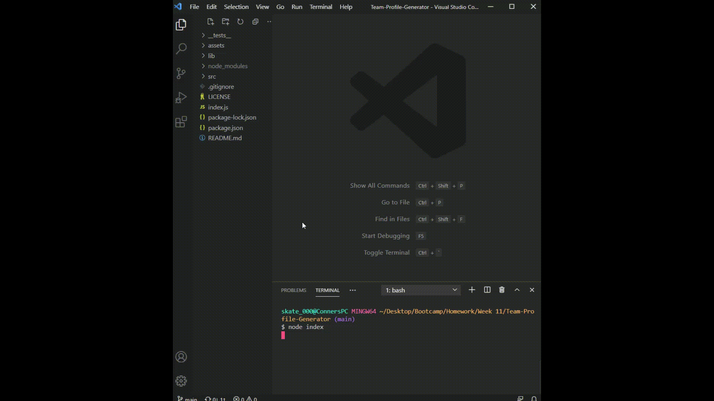

# Team Profile Generator

[](https://github.com/connerjm)
[](https://github.com/topics/node-js)
[](https://www.opensource.org/licenses/unlicense)

## Table of contents

- [Description](#description)
- [Features](#features)
- [Demonstration](#demonstration)
- [Install](#install)
- [License](#license)

## Description

Team Profile Generator is a Node.js command line application that will ask a user a series of questions and generate an HTML file displaying summaries for each member of the team.

## Features

- Builds an html file based on user input.
- Includes header.
- Each employee has a card with their information.
- Saved into a folder with an accompanying css file.

## Demonstration

Quick and simple.


## Install

Start by cloning this project:

```bash
$ git clone https://github.com/Connerjm/Team-Profile-Generator.git
```

First install dependencies:

```bash
$ npm i
```

Then run the application:

```bash
$ node index.js
```

## License

Team Profile Generator is released under the [Unlicense](https://www.opensource.org/licenses/unlicense).
